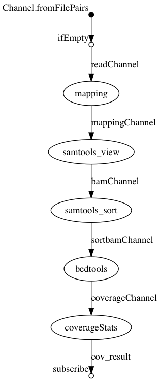

# Nextflow-Introduction to M2BIB

- The TP instructions are in the file [sujet.pdf](sujet.pdf)
- The presentation is in the file [nextflow_intro.pdf](nextflow_intro.pdf)
- Example pipelines are located in [nf-example](nf-example)

## Conda installation:
Install miniconda :   [conda.io/miniconda](https://conda.io/miniconda)

## Nextflow installation

```
conda install -c bioconda nextflow
```

## Target pipeline


